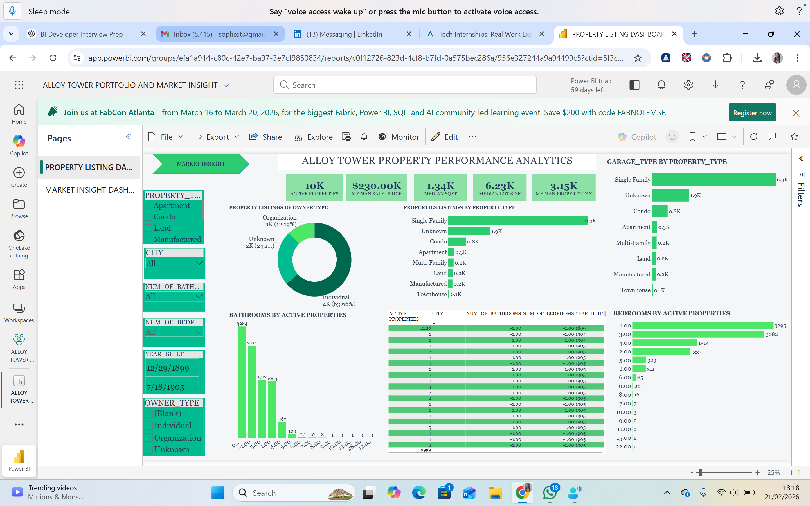
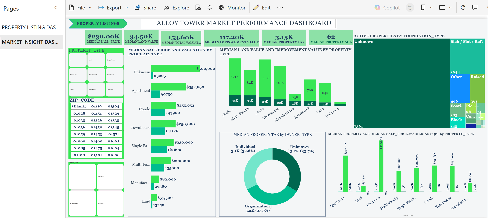

# 📊 Centralized Data Platform Project

## 📌 Overview
This project demonstrates the design and implementation of a centralized data platform that integrates multiple data sources into a single source of truth for reporting and analytics.

---

## 🎯 Objective
To improve data accessibility, reduce manual reporting, and enable faster, data-driven decision-making.

---

## 🧱 Architecture
- Data ingestion: APIs and external data sources  
- Storage: AWS S3  
- Data integration: Airbyte  
- Data warehouse: Snowflake  
- Data transformation: Bronze / Silver / Gold layers  
- Visualisation: Power BI  

---

## 🔗 Data Sources
- Property listings  
- Customer inquiries  
- Market data  

---

## 📊 Key Features
- Integration of multiple data sources  
- Automated data pipelines  
- Centralised data model  
- Interactive dashboards  

---

## 📈 Impact
- Reduced manual reporting by 40%  
- Improved data accessibility  
- Enabled faster decision-making  

---

## 🛠️ Tools Used
- Python  
- AWS S3  
- Airbyte  
- Snowflake  
- Power BI  

---

## 📷 Dashboard Preview

